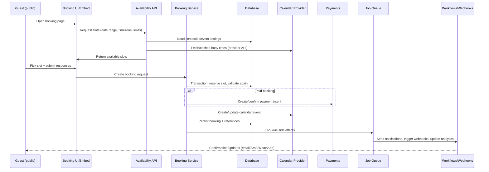

# Deep research on Cal.com for building a comparable scheduling platform

## Executive summary

Cal.com positions itself as “open scheduling infrastructure” spanning individual scheduling, team/organisation scheduling, developer embeddings, and enterprise compliance controls. citeturn15search13turn16search11 Its product surface can be understood as three layers: (a) core scheduling (event types, availability, booking pages, calendar conflict checks, time zones, buffers/limits), (b) team/enterprise coordination (round-robin, collective meetings, managed event types, routing forms, admin controls), and (c) platform/developer interfaces (app marketplace, API v2, webhooks, embeds, React “Atoms”, and a CLI). citeturn13search10turn6search0turn5search1turn6search2turn17search10turn10view3turn11search9turn7search10

A “build-your-own” effort is primarily an engineering problem in availability computation, atomic reservation/booking, and multi-calendar integration. Cal.com’s own developer documentation illustrates a typical implementation pattern: UI → type-safe API handler (tRPC in their stack) → service layer → database query → response. citeturn20view0 For your own product, the most important architectural decision is to separate (1) *slot computation* (deterministic, cacheable, query-heavy) from (2) *booking creation* (transactional, concurrency-sensitive, side-effectful). Cal.com’s webhook model reinforces this: bookings produce events such as created/rescheduled/cancelled/paid/meeting-ended, which are then consumed by automations, routing logic, analytics, and third-party systems. citeturn10view3turn14search6

Cal.com is open source, but with an important licensing boundary: core code is under AGPLv3, while specific enterprise directories are under a commercial licence (notably under `packages/features/ee` and `apps/api/v2/src/ee`). citeturn9view0 If your goal is “build my own version” (not a fork), the codebase and docs are still extremely valuable as a reference architecture and for feature discovery, but you should plan for independent implementation and IP-safe UX/content.

## Product and market context

Cal.com’s positioning is explicitly “infrastructure” (not only a standalone SaaS booking link). citeturn15search13turn16search11 Practically, that means it sells into multiple markets:

- **Individual scheduling**: unlimited event types/calendars, mobile apps, embeds, payments, and integrations even on free tiers (as presented on its pricing page). citeturn13search10  
- **Teams**: round-robin, collective scheduling, managed event types, workflows, routing forms, booking analytics. citeturn13search10turn6search0turn5search1turn5search2turn6search15turn6search2  
- **Organisations & enterprise**: SSO/SCIM, role-based permissions, domain-wide delegation, additional APIs, and dedicated database/onboarding on enterprise. citeturn13search10turn8search11turn8search6turn5search5  

This scope puts it in direct conversation with mainstream scheduling tools and with revenue-routing specialists. A useful way to frame competitor positioning is “how far beyond *one person’s booking link* does the product go?”:

- entity["company","Calendly","scheduling software company"] typically leads in mainstream adoption and simplicity; its pricing page emphasises tiers and enterprise procurement options. citeturn21search0  
- entity["company","SavvyCal","scheduling software company"] differentiates (per its own positioning) on a more polished scheduling-link experience and team features at straightforward per-user pricing. citeturn21search1  
- entity["company","YouCanBookMe","scheduling software company"] strongly emphasises “customisable scheduling experience”, and its official pricing page shows plan constraints such as calendar connections/booking pages even on free. citeturn21search3  
- entity["company","Chili Piper","revenue routing company"] is positioned around revenue workflows—routing + instant scheduling integrated into sales operations and CRMs (it explicitly highlights routing and CRM integration on its pricing page). citeturn21search2  
- Cal.com’s differentiation is the combination: open-source/self-hosting + app marketplace + enterprise controls + routing forms/attributes that mimic revenue-routing products while retaining general booking-link ergonomics. citeturn15search5turn13search10turn6search2turn7search27turn3search5turn8search11  

### Pricing and monetisation models

The Cal.com pricing page (as of the retrieved version) presents four tiers with annual per-user pricing shown for Teams and Organisations, and a custom Enterprise tier. citeturn13search10

| Tier | Price basis | What it unlocks (not exhaustive) | Notes / implementation implications |
|---|---:|---|---|
| Free | Free forever | 1 user; unlimited event types & calendars; email/SMS notifications; “integrate with 100+ apps”; mobile app + browser extension; accept payments; CRM sync; import competitor events | If you copy this model, be careful: “free” features that trigger paid external infrastructure (SMS, webhooks, CRM writes) need hard quotas and abuse controls. citeturn13search10turn6search23turn10view3 |
| Teams | $12 per user/month (yearly shown) | 1 team; round-robin; managed & collective event types; recurring events; customisable email/SMS notifications; routing forms; booking analytics; custom APIs | “Custom APIs” implies an API tier or feature gating. Team primitives require membership, shared event types, and allocation strategies (weights, least-recent, priorities). citeturn13search10turn6search0 |
| Organisations | $28 per user/month (yearly shown) | Unlimited sub-teams; route by custom variables; company subdomain; SAML SSO + SCIM; “domain-wide delegation”; RBAC; additional APIs; compliance checklist | Implementing this requires multi-tenant boundaries, identity provisioning, and admin policy surfaces. citeturn13search10turn8search11turn5search5 |
| Enterprise | Custom | Dedicated onboarding/engineering support; SLA; HRIS/directory integrations; priority support; dedicated database | Dedicated database implies per-tenant isolation options and an ops model for migrations/upgrades. citeturn13search10 |

Cal.com also monetises **workflow messaging via credits** (for SMS/WhatsApp), which is a practical “variable cost recovery” mechanism. citeturn6search23turn6search15

## Exhaustive feature mapping and core user flows

This section is structured as a feature map you can translate into epics. Where details are not explicitly confirmed in sources, the item is marked **Unspecified** (and treated as a design choice for your implementation).

### Core scheduling primitives and user flows

**Account → calendars → availability → event types → booking page → booking lifecycle** is the dominant flow described in Cal.com’s help and developer materials. Event types are the public-facing meeting templates (title/slug/duration/availability/location) and can be created in unlimited quantity per account. citeturn5search14turn13search10 Availability schedules support defaults (e.g., 9–5) and changes via date overrides. citeturn4search16turn4search0

Key booking controls are exposed at event-level as “limits”, including minimum notice, buffers, and slot intervals, with additional constraints such as rolling/limit-future-bookings described in Cal.com’s product materials. citeturn3search8turn3search24turn4search25turn3search32turn7search7 Time zone handling includes automated detection plus an option to lock the booking page time zone to the organiser (especially for in-person events). citeturn4search5turn4search9

**Recurring bookings** are supported as a first-class concept: attendees “book once” and a repeating series is created based on frequency parameters; Cal.com help notes at least one limitation (rescheduling recurring events not possible at the time of that doc). citeturn4search15turn4search23turn4search27turn4search35

### Team scheduling primitives

Cal.com distinguishes multiple team event scheduling types:

- **Round-robin** distributes meetings across team members with selection strategies including weights, priorities, and least-recently-booked (as described on its help page). citeturn6search0  
- **Collective events** require multiple people to attend the same meeting; availability is evaluated across members (with an option to override member schedules with a common schedule for the event type). citeturn5search1turn6search1  
- **Managed event types** let admins define and “push” event types to members with some fields locked; help docs also call out a limitation: “Managed Events v2 do not support Webhooks and Apps” (at least at the time of that page). citeturn5search2turn6search6  

**Dynamic group links** allow on-the-fly creation of a collective booking link by concatenating usernames with `+`; this is opt-in per user. citeturn5search0turn5search7

### Routing forms and workflows

Cal.com markets routing forms as lead-intake forms that route prospects to the right person/event type based on answers, with embedded forms and analytics. citeturn3search5turn6search2 Organisations can use **attributes** for routing logic (tag users with attributes and route based on those); attribute-based routing is explicitly described in help materials and is plan-gated (attributes limited to Organisations/Enterprise per the routing-with-attributes guide). citeturn6search7turn6search5

**Workflows** provide automation with triggers and actions, supporting notification channels including email, SMS, and WhatsApp. Plan limitations are documented: free plan has default reminder email only (no customisation), higher plans have full access; self-hosted instances are described as having no workflow usage restrictions. citeturn6search15turn3search2 SMS/WhatsApp messaging operates on a credit system per member/month. citeturn6search23

### UI/UX components and embeddables

Cal.com supports multiple **embed formats** through an embed snippet generator, including inline, floating button, click-triggered popup, and email embed. citeturn7search10turn7search2 Help docs state there are “four ways” to embed, and snippets are automatically updated for the instance (including self-hosted). citeturn7search6turn3search11

The embed system provides configuration “instructions” and also has a documented internal event bus for iframe↔parent communication (internal events are prefixed with `__` and may change). citeturn7search18turn9view3

Cal.com also publishes first-party mobile/companion apps and browser extensions as part of its cross-device scheduling story. citeturn7search3turn7search23

image_group{"layout":"carousel","aspect_ratio":"16:9","query":["Cal.com booking page screenshot","Cal.com embed widget inline popup floating button","Cal.com app store integrations page","Cal.com Insights dashboard screenshot"],"num_per_query":1}

### Comprehensive feature list with implementation notes

The table below maps major Cal.com capabilities into buildable modules. It is intentionally “engineering-forward” (what state you need, what services exist, where complexity hides).

| Area | Feature (what users perceive) | Evidence (primary sources) | Implementation notes (how to build it) |
|---|---|---|---|
| Accounts | Email + OAuth sign-up; per-user profile | API v2 supports OAuth / API keys; CLI uses API keys citeturn11search3turn11search9 | Implement auth + sessions; if multi-tenant, include org-scoped identity + username-in-org concept (Cal webhooks include `usernameInOrg`). citeturn10view3 |
| Calendars | Multiple calendar connections; conflict checks against connected calendars | Cal blog describes many calendar connection options; app store model citeturn4search38turn7search27 | Normalise calendar providers behind a “busy time” abstraction; store selected calendars per user; cache busy windows. API v2 has “selected calendars” endpoints. citeturn17search4 |
| Availability | Named schedules; default working hours; per-day toggles | Help on setting availability + default 9–5 citeturn4search16turn4search12 | Data model: schedules + rules (weekday, start/end). Provide overrides and “closed all day”. |
| Overrides | Date overrides to add/alter availability for specific dates | Help + blog on date overrides citeturn4search0turn4search20 | Overrides should apply after base schedule rules; store as date intervals; include “unavailable all day”. |
| Time off | Out-of-office blocks calendar; optional reroute to colleagues | OOO feature page + blog citeturn5search3turn5search12 | Represent OOO as a high-priority unavailability source; optionally expose “redirect link” behaviour for teams (separate routing outcome). |
| Event types | Unlimited event types; custom slug/duration/location; booking questions | Event type help; booking questions help citeturn5search14turn7search24 | Data model: EventType {slug, length(s), location options, questions schema}. Support field identifiers + templating (Cal’s update notes show variables). citeturn7search4 |
| Limits | Minimum notice; buffers before/after; slot intervals; limit-future/rolling windows | Minimum notice + buffers + rolling dates citeturn3search8turn3search24turn3search32turn4search25 | Slot generator must apply: notice cutoff, pre/post buffers (expand busy blocks), slot interval grid, future horizon. |
| Time zones | Auto-detect attendee time zones; lock booking page time zone | Blog + help on lock timezone citeturn4search5turn4search9 | Always store timestamps in UTC; compute display in attendee TZ; locking means forcing UI TZ and preventing conversion ambiguity. |
| Booking links | “Dynamic link” that always reflects current availability | Cal blog on dynamic links citeturn5search17 | Essentially: booking page queries live availability at render time (or short TTL cache). |
| Booking flow | Public booking page → choose slot → submit details → confirmation email | Webhooks doc shows booking lifecycle triggers & payload model citeturn10view3turn14search3 | Separate “availability check” from “create booking” transaction; after booking, enqueue side effects (calendar writes, notifications, webhooks). |
| Rescheduling/cancel | Via email link or user dashboard | FAQs + booking dashboard walk-through citeturn5search10turn15search8 | Treat reschedule as new booking + cancellation (linked by reschedule UID); preserve audit. Webhooks include reschedule. citeturn10view3 |
| Recurring | Booker schedules a repeating series (weekly/monthly/yearly); unsubscribe cancels future | Recurring help + blog citeturn4search15turn4search35 | Store recurrence rule + occurrences; creation should atomically reserve all instances or fail/partial policy (design choice). Cal notes rescheduling recurring not possible (so you can simplify MVP). citeturn4search15 |
| Team: round-robin | Pool availability; assign host by weights/priorities/least-recent | Round-robin help citeturn6search0 | Implement “candidate hosts” set; derive eligible slots as union; assignment function chooses host at booking time; persist assignment metrics for fairness. |
| Team: collective | Book one meeting with multiple required hosts | Collective events help citeturn6search1 | Slot computation is intersection, not union; allow “common schedule override” per event type. |
| Team: managed events | Admin-defined event templates pushed to members with locked fields | Managed events help citeturn6search6 | Implement parent template + child instances; store locked-field mask; distribute changes reliably. Note limitation: webhooks/apps not supported for Managed Events v2 in Cal docs (so decide if you will support). citeturn6search6 |
| Group links | Build-a-link group booking via `+` usernames (opt-in) | Dynamic group links help citeturn5search0turn5search7 | Parse URL path into participant set; ensure each participant opted in; compute intersection (collective). |
| Routing forms | Multi-step intake + branch to event type/person; attribute matching; insights | Routing product page + help routing overview citeturn6search2turn6search7 | Model as Form {fields, steps, routing rules}. Outputs: selected event type + constraints + metadata. Persist responses for analytics and webhook triggers (`Form Submitted`). citeturn10view3turn14search6 |
| Workflows | Triggered notifications (email/SMS/WhatsApp) + multi-action | Workflows overview + limitations citeturn6search15turn6search19 | Event-driven engine: triggers from booking lifecycle; actions to channels. Include templating, per-plan gating, credit accounting. citeturn6search23 |
| Payments | Paid bookings per event type; Stripe/PayPal options; cancellation/no-show fees | Paid bookings help + PayPal app + pricing page citeturn13search2turn13search1turn13search10turn13search18 | Payment intent before confirmation; webhook triggers include payment initiated/paid; enforce booking state machine. citeturn10view3 |
| Embeds | Inline/popup/floating/email embed; snippet generator; UTM tracking | Embed docs + UTM tracking help citeturn7search10turn7search2turn7search26 | Provide iframe embed + JS loader; implement postMessage protocol; support theming and sizing. Cal documents internal embed events. citeturn9view3 |
| Analytics | Insights dashboard; booking page analytics injection | Insights blog + booking analytics help citeturn15search3turn7search1 | Analytics data model must capture bookings, cancels, no-shows, routing outcomes. For aggregations, Cal recommends raw SQL for performance. citeturn20view0 |
| Admin & org | Subteams, RBAC, audit logs, SSO/SCIM, domain-wide delegation | Organisations page + SSO/SCIM docs + domain-wide delegation update | Multi-tenant boundary: org → teams → users. Implement RBAC as permissions graph; audit logs are a dedicated event stream. citeturn8search11turn8search7turn8search15turn5search5 |

## Architecture and implementation guidance

### Architectural principles to copy

1. **Treat scheduling as infrastructure, not UI**. The booking UI is replaceable (web, embed, partner app), but the availability/booking engine and integration layer are the moat. Cal.com’s “Atoms” and embeds embody this platform-first approach. citeturn17search10turn7search10turn7search27  
2. **Event-driven core**. Webhooks cover a wide set of triggers (booking created/cancelled/rescheduled/paid, meeting started/ended, routing form submitted, no-show updates, etc.) indicating an internal event model that is reused across automations and integrations. citeturn10view3turn14search6  
3. **Service-layer separation**. Cal.com’s own contribution guide for Insights diagrams a consistent architecture: UI component → tRPC handler → service → DB query. citeturn20view0  

### Reference diagrams in Mermaid

#### System components

```mermaid
flowchart TB
  subgraph Clients
    Browser[Public Booking Page]
    Embed[Embeds: inline/popup/floating/email]
    Dashboard[User/Team Dashboard]
    Mobile[Mobile/Companion Apps]
    Partner[Partner App using UI components ("Atoms")]
  end

  subgraph CoreApp["Scheduling Web App"]
    UI[Frontend UI]
    Auth[Auth & Session]
    SlotAPI[Slots/Availability API]
    BookingAPI[Booking API]
    Admin[Teams/Org Admin]
  end

  subgraph Backend["Core Services"]
    Scheduler[Slot Computation Engine]
    BookingSvc[Booking Transaction Service]
    WorkflowSvc[Workflows & Messaging]
    RoutingSvc[Routing Forms & Assignment]
    AnalyticsSvc[Insights/Reporting]
    IntegrationSvc[Integration Connectors]
    WebhookSvc[Webhook Delivery]
  end

  subgraph Data
    DB[(PostgreSQL)]
    Cache[(Cache/Redis)]
    Queue[(Job Queue)]
  end

  subgraph External["External Systems"]
    CalProv[Calendar Providers]
    Video[Video Providers]
    Pay[Payment Processors]
    CRM[CRM/Marketing Tools]
    Autom[Automation Platforms]
  end

  Browser --> UI
  Dashboard --> UI
  Embed --> UI
  Mobile --> SlotAPI
  Partner --> SlotAPI

  UI --> Auth
  UI --> SlotAPI
  UI --> BookingAPI
  UI --> Admin

  SlotAPI --> Scheduler
  BookingAPI --> BookingSvc
  BookingSvc --> DB
  Scheduler --> Cache
  Scheduler --> DB

  BookingSvc --> Queue
  Queue --> WorkflowSvc
  Queue --> IntegrationSvc
  Queue --> WebhookSvc
  Queue --> AnalyticsSvc
  RoutingSvc --> DB

  IntegrationSvc --> CalProv
  IntegrationSvc --> Video
  IntegrationSvc --> Pay
  IntegrationSvc --> CRM
  WebhookSvc --> Autom
```

#### Booking creation data flow



These diagrams align with Cal.com’s published primitives: embeds and Atoms as alternate clients, workflow/webhook triggers, and a service layer that can query the database efficiently (raw SQL for analytics). citeturn7search10turn17search10turn10view3turn20view0

### Recommended tech stack for a “Cal.com-class” build

This stack is not “the only way”; it’s chosen to match the constraints implied by Cal.com’s docs: high UI iteration speed, type-safe APIs, and heavy relational scheduling queries.

- **Frontend**: React + a full-stack framework (Next.js-like) for SSR booking pages and a dashboard. (Cal.com itself recommends Node 18 in its docs and uses a monorepo with apps/packages.) citeturn11search2turn9view1  
- **Backend API**: Type-safe RPC (tRPC-like) for internal UI calls; public REST/HTTP API for external integrations (Cal.com’s API v2). citeturn20view0turn11search3  
- **Database**: PostgreSQL (Cal.com explicitly requires PostgreSQL and Prisma for DB maintenance). citeturn8search2turn11search2  
- **Cache**: Redis (or equivalent) for slot computation caches and rate limiting (not specified by Cal.com sources; recommended by inference). **Unspecified** in Cal.com sources.  
- **Background jobs**: Queue (BullMQ/Sidekiq-style) for calendar writes, webhook delivery retries, workflow sends, analytics ingestion. Webhooks/events in Cal.com strongly imply asynchrony. citeturn10view3  
- **Search/logging/observability**: OpenTelemetry + log aggregation; metrics on booking latency, provider error rates, webhook delivery success. **Unspecified** in Cal.com sources; required for production scale.  
- **Feature flags**: Required for plan gating and staged rollouts; Cal.com docs mention feature flags for managed event types on self-hosted. citeturn6search6  

### Estimated effort/complexity per feature

Estimates assume 1 experienced engineer-week = ~5 focused days, excluding product design. Complexity reflects correctness risk and integration burden.

| Module | MVP? | Complexity | Typical effort | Why it’s hard |
|---|---|---:|---:|---|
| Auth + accounts + profiles | Yes | Medium | 1–2 weeks | Multi-tenant usernames, invite flows, secure sessions. API v2 supports OAuth + API keys. citeturn11search3 |
| Availability schedules + overrides | Yes | High | 2–4 weeks | Edge cases: overrides, time zones, DST. Cal.com has date overrides and OOO routes. citeturn4search0turn5search3 |
| Event types + booking questions | Yes | Medium | 2–3 weeks | Schema evolution + templating variables. citeturn5search14turn7search4turn7search24 |
| Slot computation engine | Yes | Very high | 4–8 weeks | Performance + correctness + caching + provider rate limits; must apply buffers/notice/intervals/rolling horizons. citeturn3search24turn3search8turn3search32turn4search25 |
| Booking transaction + concurrency | Yes | Very high | 4–6 weeks | Prevent double booking; idempotency; retries; state machine for paid/confirmed. Webhook model implies many states. citeturn10view3 |
| Calendar provider integration | Yes (start with 1) | High | 3–6 weeks per provider | OAuth, webhooks/push where possible, event updates, attendee management. Self-host docs show deep provider setup. citeturn12search0turn14search10 |
| Email notifications | Yes | Medium | 1–2 weeks | Templates + localisation; deliverability; verification links. **SMTP custom domain** appears as a roadmap item in v6.3 notes. citeturn15search4 |
| Embeds (iframe + JS loader) | Yes | Medium–High | 2–4 weeks | Responsive resizing + postMessage protocol; Cal.com documents internal embed events. citeturn9view3turn7search10 |
| Webhooks (outgoing) | Yes | Medium–High | 2–3 weeks | Retries, signing/HMAC, payload versioning; Cal.com specifies signature verification and version header. citeturn10view3 |
| Payments (Stripe first) | Optional MVP | High | 3–5 weeks | Payment state machine; refundable rules; cancellation fees. Cal.com ties paid bookings to Stripe and supports PayPal via app store. citeturn13search6turn13search1turn13search18 |
| Teams + memberships | Next | Medium | 2–4 weeks | Shared resources, visibility rules, invitations. API v2 has team endpoints. citeturn11search3 |
| Round-robin scheduling | Next | Very high | 4–8 weeks | Union availability + late binding assignment + fairness (weights/priorities/least recent). citeturn6search0turn6search16 |
| Collective scheduling | Next | High | 3–6 weeks | Intersection availability + optional common schedule override. citeturn6search1 |
| Managed event types | Later | High | 4–8 weeks | Template propagation, locked fields, compatibility gaps (Cal notes webhooks/apps limitation). citeturn6search6turn5search8 |
| Routing forms + attributes | Later | Very high | 6–12 weeks | Form builder + branching rules + assignment + analytics; plan gating. citeturn6search2turn6search5turn6search7 |
| Workflows (multi-channel) + credits | Later | High | 6–10 weeks | Trigger DSL, templating, credit ledger, deliverability. citeturn6search15turn6search23 |
| Insights analytics | Later | High | 6–10 weeks | Aggregations + permissions; Cal recommends raw SQL and shows end-to-end chart architecture. citeturn20view0turn16search6 |
| SSO/SCIM + RBAC + audit logs | Enterprise | Very high | 8–16+ weeks | Security-critical, needs strong admin UX; docs cover SSO and SCIM setup patterns. citeturn8search7turn8search15turn8search11 |

## Integrations and developer experience

### App marketplace model

Cal.com’s app store is positioned as a third-party integration “repository” and claims to be unique among scheduling tools in offering a third-party app store. citeturn7search27turn5search10 The app store also appears to treat apps as open source (“Every app published…is open source” on at least the PayPal app page). citeturn13search1

For building apps internally, Cal.com provides a CLI-driven workflow. The “How to build an app” doc shows `yarn create-app` creating a directory under `packages/app-store/`, and the “Greeter app” tutorial demonstrates a simple UI extension gated by “is app installed” checks. citeturn11search0turn10view0turn9view1

Implication for your platform: treat integrations as *plugins* with:

- A manifest/config (`config.json`-style)  
- Optional UI contributions (dashboard panels, event-type settings, booking form fields)  
- Optional server-side handlers (webhooks, OAuth callbacks, background jobs)  
- A versioning/review pipeline (for marketplace safety)

### API surface (public + internal)

Cal.com’s API v2 documentation describes three auth methods: OAuth, API key, and a deprecated “Platform” mode. It also recommends OAuth for integrations while allowing API keys, and documents key prefixes for test/live keys. citeturn11search3

Cal.com also requires a `cal-api-version` header in v2 requests; the CLI documentation repeats this and shows `cal-api-version: 2024-08-13` as a required header in examples. citeturn11search9turn11search3 This is a pragmatic approach you should copy: version your API by date header rather than only by URL.

A notable detail for “platform-style” embedding is Cal.com’s notion of **managed users** and token handling (token validity and refresh), shown in API v2 introduction text (via the docs corpus). citeturn17search0turn17search7 If your ambition includes “Calendly-like for my users”, plan for delegated scheduling access and safe token storage from day one.

### Webhooks, automation platforms, and delivery integrity

Cal.com’s webhooks guide gives a blueprint worth copying almost verbatim:

- Subscriptions configured in a UI path (`/settings/developer/webhooks`)  
- Multiple trigger types (booking lifecycle, meeting lifecycle, form submitted, etc.)  
- Optional shared secret, with verification via `x-cal-signature-256` HMAC  
- Payload versioning via `x-cal-webhook-version` header  
- Optional custom payload templates to reduce integration glue-code citeturn10view3turn14search6  

The same guide explicitly positions **entity["company","Zapier","automation platform company"]** as a no-code alternative and describes webhook associations at user or event-type level. citeturn10view3 Third-party automation platforms (for example, entity["company","Make","automation platform company"]) document connecting via API keys and consuming booking triggers. citeturn17search18

If you build your own platform, a robust webhook subsystem is non-negotiable: persistent delivery attempts, exponential backoff, dead-letter queues, and an operator UI (“recent deliveries”, “replay”, “disable on repeated failures”).

### Embeds and UI SDKs

Cal.com supports embedding through generated HTML/React snippets and an embed configuration system. citeturn7search2turn7search18 Embedded booking flows depend on an iframe and parent communication; Cal.com documents internal events prefixed with `__` and warns they can change. citeturn9view3

Cal.com’s “Atoms” are positioned as prebuilt React components that let third-party products integrate booking, availability, event type configuration, calendar connection, and payments. citeturn17search10 This is a strong product lesson: if you want others to build on your scheduler, you need both an API and a *UI kit*.

### Key integrations (calendar, video, payments, CRM, messaging)

Cal.com’s self-hosting documentation provides a “first-class” list of apps you can install by adding environment variables and setting credentials:

- entity["company","Google","technology company"] (calendar + meeting integration setup via OAuth credentials) citeturn12search0turn12search1  
- entity["company","Microsoft","technology company"] (Graph-based calendar integration) citeturn11search8turn14search10  
- entity["company","Zoom","video conferencing company"] (OAuth app credentials + redirect URI) citeturn12search2  
- entity["company","Daily","video API company"] (Cal Video integration; API key; scale plan variable) citeturn14search0turn14search31  
- entity["company","HubSpot","crm software company"] (CRM integration setup) citeturn14search7turn12search1  
- entity["company","Zoho","crm software company"] (CRM + calendar integrations) citeturn12search3turn12search1  
- entity["company","SendGrid","email delivery company"] (email delivery via API key) citeturn14search30turn12search1  
- entity["company","Twilio","communications platform company"] (SMS workflows integration on self-hosted) citeturn14search26turn8search1turn12search1  
- entity["company","Stripe","payments company"] (paid bookings; keys + webhook secret) citeturn14search19turn13search6turn13search4  
- entity["company","PayPal","payments company"] (payment app exists in Cal app store; Cal blog describes using it per-event type) citeturn13search1turn13search0turn13search10  

Cal Video is described as Cal.com’s built-in video offering, supporting up to 300-person calls and recordings; Cal’s privacy policy clarifies it is powered by Daily and that recordings are stored encrypted in object storage. citeturn14search1turn8search1

## Deployment, self-hosting, security, privacy, and compliance

### Open-source codebase structure and licensing boundaries

Cal.com is a monorepo with workspaces across `apps/*`, `apps/api/*`, `packages/*`, and specialised packages such as embeds, features, app-store, and platform examples. citeturn9view1 Its contributor docs show standard scripts (`yarn build`, `yarn test-e2e`, `yarn lint`). citeturn11search10

Licensing is mixed:

- Most of the repository is AGPLv3.  
- Enterprise feature directories are under a commercial licence (`packages/features/ee` and `apps/api/v2/src/ee`). citeturn9view0  

**Implementation takeaway**: if you build a competitor or derivative service, be careful about what you copy from enterprise directories and understand AGPL obligations if you fork and deploy as a network service.

### SaaS vs self-hosted deployment options

Cal.com explicitly supports self-hosting. Its self-hosting installation docs list requirements: Node.js, yarn, Git, and PostgreSQL, and note Prisma for database maintenance. citeturn8search2turn11search4 It also provides a Docker image on Docker Hub, signalling an “official container” path. citeturn15search16

A practical self-hosted deployment also requires the “install apps” approach above (calendar/video/payments/messaging credentials) and app-store seeding on your instance. citeturn12search1turn12search0

### Migration/self-hosting checklist and deployment steps

This checklist is designed for *your own platform*, but mirrors Cal.com’s documented operational requirements.

**Planning and licensing**
- Confirm your intended licence and that you are not copying commercially-licensed modules. citeturn9view0  
- Define your tenant model: single-tenant, multi-tenant orgs, or both. Cal.com orgs are explicitly “branded, multi-tenant environments” in its self-hosting guide. citeturn8search14turn8search27  

**Core infrastructure**
- Provision PostgreSQL and a migration mechanism (Cal.com uses Prisma). citeturn8search2  
- Decide whether you need per-tenant database isolation (Cal.com’s enterprise tier lists “dedicated database”). citeturn13search10  
- Decide job queue and cache (recommended; **Unspecified** directly by Cal.com sources).

**Application deployment**
- If containerised: base your runtime on the “official image” model (Cal.com publishes a Docker image). citeturn15search16  
- If source-based: follow a monorepo build pipeline similar to `yarn build` and run e2e tests pre-deploy. citeturn11search10  

**Integrations and credentials (minimum viable)**
- Calendar provider 1: configure OAuth and redirect URIs (Cal’s self-host docs show redirect URI patterns). citeturn12search0turn14search10  
- Email delivery: configure SMTP or a provider; Cal.com self-host docs show SendGrid as an integration option. citeturn14search30  
- Webhook secrets: generate and store securely; Cal.com uses `CALCOM_WEBHOOK_SECRET` and header-name config for syncing apps. citeturn11search12  
- App store/integration registry: seed available apps, and create an admin UI to enable/disable and store keys. citeturn11search12turn12search0  

**Operational readiness**
- Establish a webhook delivery monitor UI (success/failure, retries, replay) based on Cal’s webhook subscription model. citeturn10view3  
- Instrument slot generation latency and booking transaction success rate (recommended; **Unspecified** by Cal sources).  
- Add rate limiting for booking creation and “get slots” endpoints (Cal’s API docs show rate limiting expectations on at least some endpoints). citeturn17search11  

### Security/privacy checklist and likely compliance gaps

Cal.com asserts a strong compliance posture (HIPAA, SOC 2 Type II, ISO 27001, CCPA, GDPR) and provides a security page that includes downloadable compliance artefacts (SOC 2 report, ISO certificate, penetration test report, DPA). citeturn8search4turn8search0turn8search18 Its enterprise page also claims encryption at rest and in transit, monitoring, and configurable data residency options. citeturn8search6

Cal.com’s privacy policy provides concrete examples of subprocessor usage and data flows:
- SMS reminders via Twilio. citeturn8search1  
- “Cal Video” powered by Daily; recordings stored encrypted in object storage. citeturn8search1  
- Payment card details handled by payment processors; Cal references PCI-DSS alignment through processors. citeturn8search1  

If you build your own version, use the following as a baseline checklist:

**Data protection**
- Encrypt data in transit (TLS everywhere) and at rest (DB + backups). (Cal enterprise page claims both.) citeturn8search6  
- Define data retention for bookings, recordings, transcripts, and logs (Cal exposes recordings/transcripts in APIs; you must handle retention). citeturn14search2turn14search8  
- Implement tenant isolation: org-level boundaries, row-level security, or separate databases (Cal enterprise: “dedicated database”). citeturn13search10  

**Webhook and integration security**
- Sign webhook payloads (HMAC) and rotate secrets; Cal specifies signature verification and encourages secrets. citeturn10view3  
- Treat booking UIDs as secrets when they grant attendee access (Cal’s FAQ analogises bookingUID to a password). citeturn5search10  

**Identity and access management**
- RBAC for admins/members; plan for audit logs (Cal org plan lists RBAC + audit logs). citeturn8search11turn8search3  
- Enterprise SSO (SAML/OIDC) + SCIM provisioning (Cal provides setup docs). citeturn8search7turn8search15  

**Compliance gaps to plan for**
- Cal.com provides compliance claims and downloadable artefacts; your product will need its own audits, DPAs, subprocessor list, and incident response. Cal’s security page demonstrates the expected enterprise artefact set. citeturn8search4  
- Data residency: Cal enterprise mentions configurable data residency. If you need this, design for region-bound storage and processing early. citeturn8search6  
- HIPAA: Cal has HIPAA-related materials; if you target healthcare, you must implement strict access controls, logging, and BAAs with subprocessors. citeturn8search21turn8search12  

### Localisation and accessibility

Cal.com passes language/locale with organiser and attendees in webhook payload examples (a `language.locale` field), which indicates locale is modelled at the user/attendee layer. citeturn10view3 Cal.com also describes browser-level fallback detection for time zones (and mentions multi-language support in at least one recent blog post). citeturn4search9turn4search29

Accessibility (WCAG conformance, keyboard navigation, ARIA, colour contrast) is **not explicitly specified** in the retrieved primary sources. For your build, treat this as a first-class requirement because booking flows are public-facing and must work across devices and assistive tech.

### Testing/QA and observability

Cal.com’s open-source contribution docs prescribe end-to-end testing (`yarn test-e2e`) and linting (`yarn lint`), suggesting a CI model where critical flows are verified in browsers. citeturn11search10

Observability is not deeply specified in the retrieved sources (beyond mentions of monitoring/security on enterprise pages). citeturn8search6turn8search4 For your implementation, minimum required signals are:
- Slot query latency (p50/p95), cache hit rate, provider API latency/errors  
- Booking transaction success rate, double-booking prevention metrics  
- Webhook delivery success, retries, and time-to-delivery  
- Workflow send success + cost per message (especially if you adopt a credit model like Cal.com). citeturn6search23  

### Performance and scaling considerations

Two Cal.com sources provide concrete performance clues:

- The Insights “add chart” guide recommends raw SQL (`$queryRaw`) for complex aggregations and notes Prisma v6 SQL composition constraints, implying that analytics queries can become a bottleneck without careful design. citeturn20view0  
- Booking analytics and routing insights are heavily marketed, which implies large volumes of booking events become reporting data. citeturn6search2turn7search21turn16search6  

For your own system, the scaling hotspots are typically:

- **Availability computation**: O(N calendars × busy blocks × rules) if naive; you need interval-set operations, caching, and short-circuiting.  
- **Concurrency at booking time**: enforce unique constraints (by organiser/resource + start time), hold/lock slots, and re-check availability in-transaction.  
- **Integration fan-out**: calendars + video + payment + CRM updates should be queued and retried, not blocking the booking confirmation UI.  
- **Reporting**: pre-aggregate bookings into fact tables (daily/hourly per event type/team) rather than scanning raw bookings for every dashboard load.

## Suggested MVP scope, roadmap, risks, and open questions

### MVP scope

A realistic MVP that still feels “Cal.com-like” should prioritise correctness and developer extensibility over enterprise breadth:

**MVP features**
- Single-user accounts + authentication. citeturn11search3  
- Event types (title/slug/duration/location) and booking questions. citeturn5search14turn7search24  
- Availability schedules + date overrides. citeturn4search16turn4search0  
- Time zone display + optional lock-to-organiser. citeturn4search5turn4search9  
- Buffers + minimum notice + slot interval controls. citeturn3search24turn3search8turn4search25  
- One calendar provider integration (start with Google or Microsoft; Cal’s self-host docs show both). citeturn12search0turn14search10  
- Email notifications + basic reschedule/cancel links. citeturn5search10turn15search8  
- Webhooks (booking created/cancelled/rescheduled) with HMAC signing. citeturn10view3  
- Embeddable booking widget (inline + popup). citeturn7search10turn7search2  

**Explicitly not MVP (defer)**
- Round-robin/collective/managed team event types. citeturn6search0turn6search1turn6search6  
- Routing forms/attributes. citeturn6search2turn6search5  
- Workflows with SMS/WhatsApp and credit ledgers. citeturn6search15turn6search23  
- SSO/SCIM, RBAC, audit logs. citeturn8search11turn8search7turn8search15  
- Cal Video equivalents, transcripts, and recording. citeturn14search1turn14search8  

### Roadmap with milestones and timelines

Assuming start date **March 2026**, one senior engineer + one product/designer, and a goal of a production MVP in ~12–14 weeks:

**Weeks 1–2: Foundations**
- Data model: users, event types, schedules, overrides, bookings.
- Auth and session management; basic settings UI.
- CI with lint + e2e harness (mirror Cal’s `test-e2e` discipline). citeturn11search10  

**Weeks 3–6: Slot engine + booking transaction**
- Slot generation with notice/buffers/intervals; time zone handling.
- Transactional booking creation + idempotency keys.
- Email confirmations + reschedule/cancel UX.

**Weeks 7–9: Calendar integration v1**
- One provider OAuth + busy time fetch + event create/update.
- Reconciliation job for failures (queue + retries).

**Weeks 10–11: Embeds + webhooks**
- Embed snippet generator (inline + popup) and responsive resizing.
- Webhook subscriptions + signing + delivery logs. citeturn10view3turn7search2  

**Weeks 12–14: Hardening**
- Rate limiting, abuse prevention, audit trail for bookings.
- Performance tuning and caching.
- Documentation (API + embed guide) and a starter SDK.

**Post-MVP (quarter 2)**
- Teams + round-robin, then collective scheduling. citeturn6search0turn6search1  
- Payments (Stripe first; later PayPal). citeturn13search6turn13search1  
- Workflows + credits. citeturn6search23turn6search15  
- Routing forms + attributes + routing analytics. citeturn6search2turn6search5turn6search7  

### Risks and trade-offs

**Calendar correctness and edge cases** (highest risk)  
Time zones, DST, recurring series, overrides, buffers, and multi-calendar conflict checks interact in non-obvious ways. Cal.com explicitly calls out several of these features (lock timezone, rolling dates, buffers, min notice), which is a signal of complexity that will surface in support load. citeturn4search5turn3search32turn3search24turn3search8

**Round-robin fairness + availability pooling**  
Cal.com’s round-robin selection talks about weights/priorities/least-recent assignment, and later content describes multi-role “round-robin groups”. Implementing this correctly requires a persistent assignment history and careful race-condition handling. citeturn6search0turn6search16turn5search21

**Workflow/message cost control**  
Cal.com uses credits and plan limitations for workflow channels, which is a strong clue that without quotas the economics break (SMS and WhatsApp are not free). citeturn6search23turn6search15

**Security model of “public booking pages”**  
Booking links and booking UIDs can become bearer secrets; Cal.com explicitly warns that bookingUID functions like a password in at least one FAQ answer. Design your access model around this (short-lived tokens, scoped permissions, revocation). citeturn5search10

**Licensing and “inspiration vs derivation”**  
Because Cal.com has AGPL components and commercially-licensed enterprise directories, you should be deliberate: read and comply with licences, and treat Cal as a reference rather than a copy-paste foundation if you will run a proprietary SaaS. citeturn9view0turn15search5

### Open questions you should resolve early

- **Booking transaction model**: do you “hold” a slot temporarily during checkout/intake, and for how long? (Cal.com’s webhooks include payment initiated/paid, implying multi-step booking states.) citeturn10view3  
- **Recurring series policy**: all-or-nothing vs partial booking when some occurrences are unavailable. (Cal.com docs note constraints like no rescheduling in recurring events, which may be a simplification choice.) citeturn4search15  
- **Multi-tenant boundary**: is “organisation” a namespace + branding layer only, or strict data isolation with separate databases? (Cal enterprise lists dedicated database; org setup is described as multi-tenant.) citeturn13search10turn8search14  
- **Extensibility target**: API-only, or API + UI components (Atoms-style) + marketplace + CLI? (Cal runs all four.) citeturn17search10turn7search27turn11search9  
- **Compliance ambitions**: will you pursue SOC 2/ISO early, or use “self-hosted” as your compliance story? (Cal provides both: strong compliance claims and self-hosting.) citeturn8search4turn8search2  

